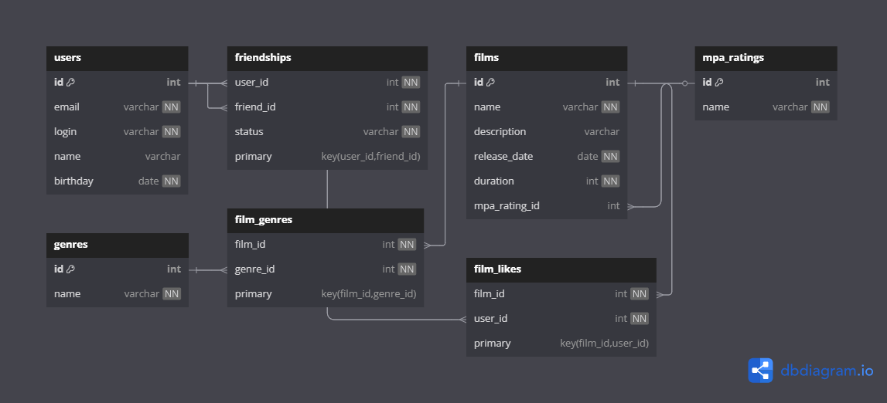

# java-filmorate
Template repository for Filmorate project.
## 📊 ER-диаграмма базы данных



## 📄 Примеры SQL-запросов

### 🎬 Получение топ-N популярных фильмов (по количеству лайков):

```sql
SELECT f.id, f.name, COUNT(fl.user_id) AS likes
FROM films f
LEFT JOIN film_likes fl ON f.id = fl.film_id
GROUP BY f.id
ORDER BY likes DESC
LIMIT 10;
```

### 🤝 Получение друзей пользователя
```sql
SELECT u.*
FROM users u
JOIN friendships f ON u.id = f.friend_id
WHERE f.user_id = 1 AND f.status = 'CONFIRMED';
```
### 👥 Получение общих друзей двух пользователей
```sql
SELECT u.*
FROM users u
JOIN friendships f1 ON u.id = f1.friend_id AND f1.user_id = 1 AND f1.status = 'CONFIRMED'
JOIN friendships f2 ON u.id = f2.friend_id AND f2.user_id = 2 AND f2.status = 'CONFIRMED';
```
### 🏷 Получение всех жанров фильма
```sql
SELECT g.*
FROM genres g
JOIN film_genres fg ON g.id = fg.genre_id
WHERE fg.film_id = 1;
```
### 🎓 Получение всех фильмов с жанрами и рейтингом
```sql
SELECT f.id, f.name, f.description, r.name AS mpa_rating, g.name AS genre
FROM films f
LEFT JOIN mpa_ratings r ON f.mpa_rating_id = r.id
LEFT JOIN film_genres fg ON f.id = fg.film_id
LEFT JOIN genres g ON fg.genre_id = g.id;
```
### 💌 Получение входящих заявок в друзья (ожидающих подтверждения)
```sql
SELECT u.*
FROM users u
JOIN friendships f ON f.user_id = u.id
WHERE f.friend_id = 1 AND f.status = 'PENDING';
```